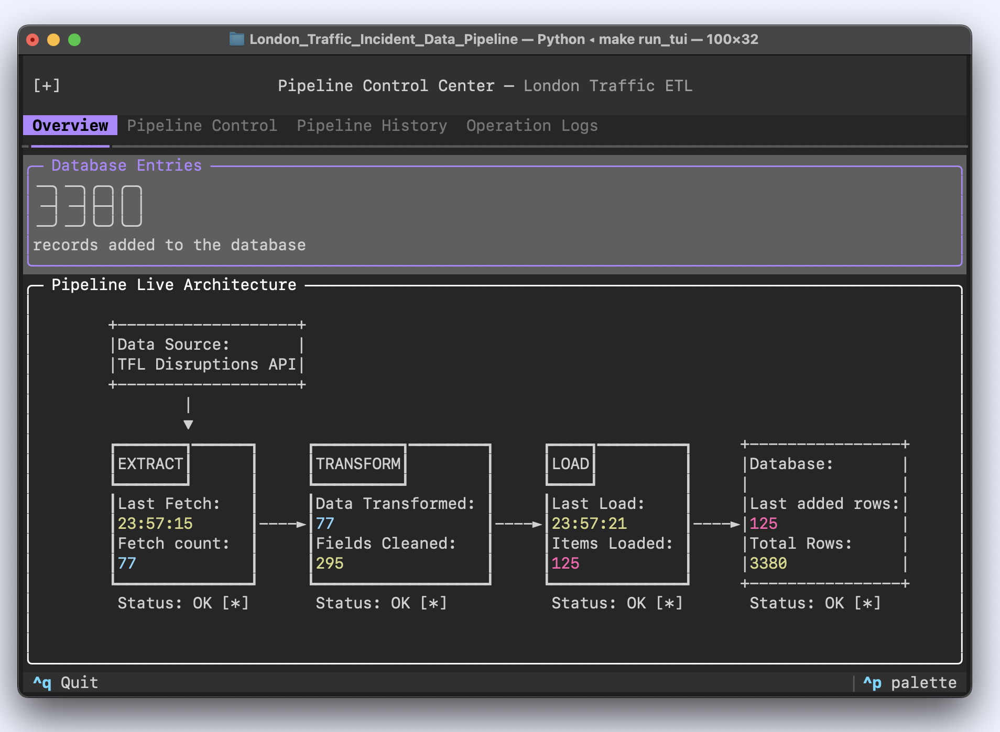
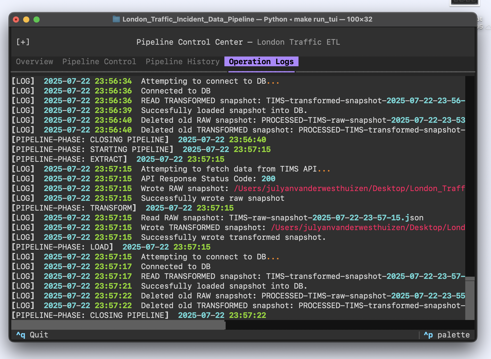

# London Traffic Disruption ETL Pipeline

## Overview
This data pipeline ingests live traffic disruption data from Transport for London (TFL) via public APIs. It processes and validates the data using **Pydantic**, stores it in a **PostgreSQL** database, and exposes it through a **FastAPI** server. The project also includes a terminal user interface (TUI) for infrastructure control, a suite of **Pytest** tests, and an example client that demonstrates usage of the API. 

## Pipeline Architecture
### Overview
The aim of the project is to show proficiency in python under the theme of data-engineering. The pipeline therefore strictly uses python instead of industry-grade software. The pipeline is therefore architected as close to 'first-principles' as possible - leaving the maximum possible flexibility and scope for the former requirements. 

In general, the pipeline follows an Extract, Transform, Load (ETL) structure.

> Note: **Red** lines indicate operations flow and access and **Black** indicates logical data flow. 

---

### Architectural Components
#### 1. API Endpoint TFL
This API endpoint is provided by Transport for London. Details of the endpoint connection process and data stream format can be found at: https://api-portal.tfl.gov.uk/api-details#api=Road&operation=Road_DisruptionByPathIdsQueryStripContentQuerySeveritiesQueryCategoriesQuery&definition=System-2. In addition, the data stream is live.

#### 2. Datalake
The datalake component (managed by datalake_manager.py) acts as an intermediate storage layer between each ETL step. After each processing stage—Extract, Transform, or Load—a snapshot of the data is saved to disk. This approach prevents large datasets from being held in memory and allows for easier debugging, recovery, and auditing of pipeline stages. The datalake_manager module abstracts all file operations (opening, reading, writing, and moving files), so other classes can interact with the datalake using simple, clean read and write methods, without worrying about file system details. This design simulates the behavior of production-grade datalake solutions in a lightweight, Pythonic way.

#### 3. Extract
In the Extract step, the pipeline connectes to the live TFL API endpoint and receives the latest traffic disruption data. The data is returned in JSON format and is then saved as a snapshot using the datalake. 

#### 4. Transform
In the Transform step, the raw data snapshots from the datalake are processed. This stage involves cleaning the data, validating fields and types (using Pydantic models), removing duplicates, and restructuring the data as needed for downstream storage. The transformed data is then saved back to the datalake, ready for loading into the database.

#### 5. Load
In the Load step, the transformed data is read from the datalake and batch-inserted into the PostgreSQL database. 

#### 6. Orchestrator
The orchestrator coordinates the execution of the entire ETL pipeline. It manages the order and timing of each step (Extract, Transform, Load), handles error logging, and ensures that each stage completes successfully before moving to the next. The orchestrator can be triggered manually, scheduled via cron jobs, or controlled through the TUI, providing flexibility and reliability in pipeline operations.

#### 7. Pipeline Logger
The pipeline logger is a shared object passed throughout the codebase, enabling unified logging of key events and metrics across all ETL stages. This ensures consistent and centralized monitoring of pipeline health and operations.

#### 8. API Server
The API server is built with FastAPI and exposes RESTful endpoints for querying, exporting, and interacting with the processed disruption data. It enables external applications and users to access the pipeline’s data and functionality in a protected.

| API endpoints | Database |
|----------|----------|
|  |  |

---

### Pipeline Workflow

There are various workflows with regard to pipeline operation. The pipeline can be run manually to ingest data once, in a single cycle. In addition, an external scheduler, like cron, can be used to schedule pipeline runs. This effectively causes the pipeline to run automatically. 

A TUI is provided to interact with and monitor pipeline operations. This interface allows an operator to see, at a glance, the state of the pipeline. 

---

## Other Key Contributions and Features
Other than the core pipeline itself, a TUI and Example application make for suitable additions to the codebase. 

### Terminal User Interface (TUI)
The TUI provides a command-line interface for monitoring and controlling the pipeline. It allows users to view pipeline status, trigger runs, and access logs in real time, making pipeline management accessible and user-friendly without needing to interact directly with the codebase.

---
| Overview | Pipeline Controls |
|----------|----------|
|  |  |
| Pipeline History | Pipeline Operations Log |
|  |  |
---

### Example Application
The example application completes the data lifecycle by consuming processed disruption data from our API server. It fetches data from the pipeline’s RESTful endpoints, process it, and create interactive visualizations using Plotly. 

## Technology Stack
1. Python - the core language for all pipeline logic and scripting
2. Pydantic - for data validation and sanitisation
3. PostgreSQL - for the database component
4. FastAPI - to create RESTful API endpoints with which to access the database
5. Pytest - creating unit and integration tests for the codebase
6. Pandas - manipulating data
7. Plotly - easy data visualisation in example application
8. Textual - a framework for building TUIs in python 

## Future work and extensions
The pipeline is architected in such a way that it can easily be extended. Two areas of extension are: 

1. Adding more data sources for richer insight capabilities
2. Adding more applications making use of API endpoints
3. Adding more / more varied API endpoints to the API server

## Instalation and Setup

> Note: The pipeline contains several important files in the root directory. They include: 
> 1) .env file - contains API keys, Database connection URL, etc
> 2) Makefile - for easy setup and running
> 3) requirements.txt - used when setting up
> 4) pipeline_enabled.flag - used when scheduling pipeline runs
> 5) run_pipeline.sh - used when scheduling pipeline runs
> Please ensure that all these files are present

> Note: the pipeline depends on its connection to a hosted DB as well as its connection to the TFL endpoint. Details relating to these are specified within the .env file in the root directory.
> Please ensure that this is filled out (if not by default) **before** attempting to run the pipeline. 

---

### Running instructions 
1. Clone the directory
2. Ensure all the root directory files (mentioned above) are present and configured (should be by default)
3. Navigate to the root directory

4. run `make setup`. This will automatically create and setup a python virtual environment with all the project dependencies
5. run `source pipeline_venv/bin/activate`. This will activate the python virtual environment

6. run `make run_pipeline` to run the pipeline once. Logs should be printed in pipeline_logs/pipeline_logs.log and in the terminal. 
7. run `make run_tui` to open the TUI. This is best done in a separate terminal window. 
8. run `make run_tests` to test modules using pytest
9. run `make start_api` to start the API server. This is best done in a separate terminal window. 

10. run `make run_example` to run an example application. 
> Note: this command will start a uvicorn server locally hosted. Ensure that the provided URL is specified in the .env file under PIPELINE_API_ENDPOINT. 

When finished:
11. run `make clean` to remove the virtual environment
12. run `deactivate` to return to normal shell.

> Note: A bash script run_pipeline.sh has been provided. When using an external scheduler, schedule this script to be run and not the pipeline directly - this allows for the toggle switch in the TUI to work properly.

---

